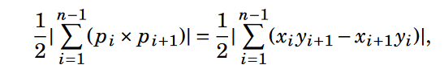

# Geometry

## Point
```cpp
const ldb PI = 3.14159265358979;
const ldb eps = 1e-9;
bool eq(ldb a, ldb b){ return fabs(a-b) < eps; }
struct Point{
    ldb x=0, y=0;
    Point(){}
    Point(ldb x, ldb y):x(x), y(y){}
    ldb Edist(const Point o){
        return sqrt((x-o.x)*(x-o.x)+(y-o.y)*(y-o.y));
    }
    ldb squareEdist(const Point o){
        return (x-o.x)*(x-o.x)+(y-o.y)*(y-o.y); }
    ldb Mdist(const Point o){
        return abs(x-o.x)+abs(y-o.y);
    }
    Point Mpoint(const Point o){
        return Point((x+o.x)/2, (y+o.y)/2);
    }
    bool ccw(const Point n, const Point m){
        return (n.x-x)*(m.y-y)-(m.x-x)*(n.y-y) > 0; }
    bool operator == (const Point o){
        return eq(x,o.x) & eq(y,o.y);
    }
    friend ostream& operator << (ostream &os, Point a){
        os << "Point( " << a.x << ", " << a.y << " )";
        return os;
    }
};

```
## Vector
```cpp
struct Vector{
    ldb a=0, b=0;
    Vector(){}
    Vector(Point x, Point y):a(y.x-x.x), b(y.y-x.y){}
    Vector(ldb a, ldb b): a(a), b(b){}
    ldb len(){ return sqrt(a*a+b*b); }
    Vector operator + (const Vector o){
        return Vector(a+o.a, b+o.b);}
    Vector operator - (const Vector o){
        return *this + Vector(-o.a, -o.b); }
    ldb dotProduct(const Vector o){
    /*also equal to |u|*|v|*cos */
        return a*o.a+b*o.b; }
    ldb crossProduct(const Vector o){
    /*also equal to |u|*|v|*sin */
    /*also equal to vec(n)*|u|*|v|*sin in 3D space */
        return a*o.b-o.a*b; }
    ldb angle(Vector o){
        return dotProduct(o)/(len()*o.len()); }
    bool operator == (const Vector o){
        return eq(a,o.a)&eq(b,o.b); }
    friend ostream& operator << (ostream &os, Vector a){
        os << "Vector( " << a.a << ", " << a.b << " )";
        return os;
    }
};
```

## Line
```cpp
struct Line{
    ldb a=0, b=0, c=0;
    Line(){}
    Line(ldb a, ldb b, ldb c):a(a), b(b), c(c){}
    Line(Point x, Point y){
        a = y.y - x.y;
        b = x.x - y.x;
        c = -a*x.x-b*x.y;
    }
    Line(Point x, Vector y){
        a = y.a;
        b = y.b;
        c = -y.a*x.x - y.b*x.y;
    }
    ldb distP(const Point x){
        return abs(a*x.x+b*x.y+c)/sqrt(a*a+b*b); }
    ldb have(const Point x){
        return distP(x) == 0; }
    pair<ldb, ldb> Intersect(const Line o){
        pair<ldb, ldb> res;
        res.se = (a*o.c-c*o.a)/(-a*o.b+b*o.a);
        res.fi = (-b*res.se-c)/a;
        return res;
    }
    Line perpendicularBisector (const Point o){
        return Line (-b, a, b*o.x-a*o.y); }
    friend ostream& operator << (ostream &os, Line a){
        os << "Line( " << a.a << ", " << a.b << ", " << a.c << " )";
        return os;
    }
};
```
## Ray
+ Same as line but distP have difference
```cpp
ldb distP(ldb xa, ya, xb, yb, xc, yc){
    Point a(xa, ya);
    Point b(xb, yb);
    Point c(xc, yc);
    Vector ba(b, a);
    Vector bc(b, c);
    Line lbc(b, c);
    if (ba.dotProduct(bc) < 0){
        return a.Edist(b);
    }
    return lbc.distP(a);
}
```
## Segment
+ Same as line but distP have difference
```cpp
ldb distP(ldb xa, ya, xb, yb, xc, yc){
    Point a(xa, ya);
    Point b(xb, yb);
    Point c(xc, yc);
    Vector ba(b, a);
    Vector bc(b, c);
    Vector ca(c, a);
    Vector cb(c, b);
    Line lbc(b, c);
    if (ba.dotProduct(bc) && ca.dotProduct(cb)){
        return lbc.distP(a);
    }
    else{
        if (ba.dotProduct(bc) < 0){
            return b.Edist(a);
        }
            return c.Edist(a);
    }
    return 0;
}
```

## Sweep Line
### Closest Point Pair
```cpp
V <Point> p;
set<Point, cmp> t;
for (int i=0; i<n; i++){
    ldb x, y;
    cin >> x >> y;
    p.push_back(Point(x, y, i));
}
sort(p.begin(), p.end());
ldb max_dist = p[0].squareEdist(p[1]);
int fans = 0, sans = 1;
FORE(P, p){
    ldb x = P.x, y = P.y;
    int idx = P.idx;
    ldb d = sqrt(max_dist);
    Point cur = {-1000005, y-d, idx};
    while (1){
        auto it = t.upper_bound(cur);
        if (it == t.end()) break;
        cur = *it;
        if (cur.y > y+d) break;
        if (cur.x < x - d){
            t.erase(it);
            continue;
        }
        if (P.squareEdist(cur) < max_dist){
            max_dist = P.squareEdist(cur);
            fans = idx;
            sans = cur.idx;
        }
    }
    t.insert(P);
}
if (fans > sans) swap(fans, sans);
```

## Polygon]

```cpp

struct Polygon{
    V<Point> p;
    Polygon(){};
    Polygon(V<Point> p):p(p){}
    ldb area(){
        ldb a = 0;
        int l = p.size() - 1;
        for (int i=0; i<l; i++){
            a += p[i].x*p[i+1].y-p[i].y*p[i+1].x;
        }
        a += p[l].x*p[0].y-p[l].y*p[0].x;
        return a/2;
    }
};
```

## Convex hull use monotone chain algorithm
```cpp
V<Point> convex_hull(V<Point> p, int n){
    sort(p.begin(), p.end(),
         [](const Point a, const Point b){
            return ((eq(a.x, b.x))?(a.y<b.y):(a.x<b.x));
         });
    V<Point> hull;
    hull.pb(p[0]);
    /*Top hull*/
    for (int i=1; i<n; i++){
        while (hull.size()>=2 &&
            hull[hull.size()-2].ccw(hull.back(), p[i])){
                hull.pop_back();
            }
        hull.push_back(p[i]);
    }
    /*Bottom hull*/
    for (int i=n-2; i>=0; --i){
        while (hull.size()>=2&&
            hull[hull.size()-2].ccw(hull.back(), p[i])){
                hull.pop_back();
            }
        hull.push_back(p[i]);
    }
    if (n > 1) hull.pop_back();
    return hull;
}
```